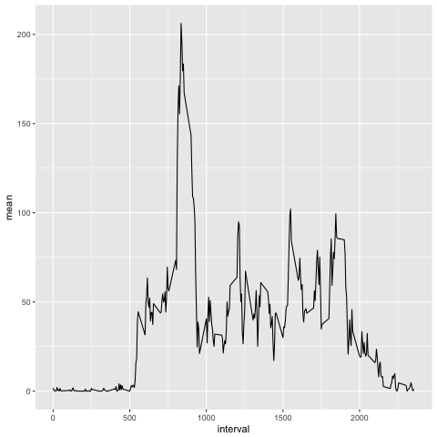

```{r setup, include=FALSE}
knitr::opts_chunk$set(echo = TRUE)
knitr::opts_chunk$set(message = FALSE)
```

## John Hopkins - Data Science Especialization
### Reproducible Research - Course Project 1

To avoid redundancy in the introduction of this assignment, I'll quote the course assigment in its whole:

> "It is now possible to collect a large amount of data about personal movement  using activity monitoring devices such as a Fitbit, Nike Fuelband, or Jawbone Up. These type of devices are part of the “quantified self” movement – a group of enthusiasts who take measurements about themselves regularly to improve their health, to find patterns in their behavior, or because they are tech geeks. But these data remain under-utilized both because the raw data are hard to obtain and there is a lack of statistical methods and software for processing and interpreting the data.

> This assignment makes use of data from a personal activity monitoring device. This device collects data at 5 minute intervals through out the day. The data consists of two months of data from an anonymous individual collected during the months of October and November, 2012 and include the number of steps taken in 5 minute intervals each day.

> The data for this assignment can be downloaded from the course web site:

> Dataset: [Activity monitoring data](https://d396qusza40orc.cloudfront.net/repdata%2Fdata%2Factivity.zip) [52K]
> The variables included in this dataset are:

> * steps: Number of steps taking in a 5-minute interval (missing values are coded as NA)
* date: The date on which the measurement was taken in YYYY-MM-DD format
* interval: Identifier for the 5-minute interval in which measurement was taken
The dataset is stored in a comma-separated-value (CSV) file and there are a total of 17,568 observations in this dataset."

## Data Processing

In order to process and analyse the proposed data, I used the following library. The Sys.setlocale code is set to ensure that all output is in english.

```{r library}
library(dplyr)
library(ggplot2)

#to set outputs in english
Sys.setlocale("LC_ALL", "en_US")

```
  
### Reading the data
In order to read the csv file, the following code was used. Note that to ensure reproducibility of the code, I created a temporary file to hold the download file and open it. This way, there is no need to set working directory manually in your own machine. Still, if you want to keep the downloaded data, I suggest you set the working directory, download the file manually of by script from the link mentioned in the Introduction section, and contenue with the analysis.

```{r reading}
#reading in temp file
temp <- tempfile()
download.file("https://d396qusza40orc.cloudfront.net/repdata%2Fdata%2Factivity.zip", temp)


data <- read.csv(unz(temp, "activity.csv"), stringsAsFactors = F)
data$date <- as.Date(data$date)
```

### Answering Assignment questions

#### What is mean total number of steps taken per day?
In order to answer, I grouped the data using the dplyr pipe system, and generated the sum of steps per day. To visualize the histogram of steps per day, I used the ggplot2 package:

```{r sum_steps}
daily_steps <- data %>% group_by(date) %>% summarise(total_daily_steps = sum(steps))

#histogram
ggplot(daily_steps, aes(x = total_daily_steps)) +
  geom_histogram()
```


It´s always useful to look at central tendency measures, like the mean and median. As we are looking at daily steps, the mean and median steps per day is:

```{r mean_median}
mean(daily_steps$total_daily_steps, na.rm = T)
median(daily_steps$total_daily_steps, na.rm = T)
```

#### What is the average daily activity pattern?
Now, how does the typical day look like? To answer it, I need to look at the average number of steps for each interval in every day, and I did as follows:

```{r timeseries}
mean_per_interval <- data %>% group_by(interval) %>% summarise(mean = mean(steps, na.rm = T))

ggplot(mean_per_interval, aes(x = interval, y = mean)) +
  geom_line()
```


To see which 5-minute interval, on average across all the days in the dataset, contains the maximum number of steps:

```{r}
#interval wth mean highest number of steps
mean_per_interval %>% filter(mean == max(mean))
```

#### Imputing missing values
There are plenty missing values in the collected data:

```{r missing}
#total number os NAs
summary(data)
```

Such missing data can get in the way of proper statistical analysis, so I devised a method to fill them in. By identifying which line of the dataset has a missing value for step, my loop replaces it the mean value of steps given in the corresponding interval. To keep the original data intact, I created a replica and operated on it:  

```{r filling}
data2 <- data
x <- data.frame(0,0,0,0)

for(i in 1:nrow(data2)) {
  if(is.na(data2[i,1] == T)) {
    x <- left_join(data2[i,], mean_per_interval, by = 'interval')
    data2[i,1] <- x[,4]
  }
}
```

Now lets see how filling the missing affected the data by looking at he daily steps histogram, and the distribution mean and median:

```{r mean_median2}
daily_steps2 <- data2 %>% group_by(date) %>% summarise(total_daily_steps = sum(steps))

#histogram
ggplot(daily_steps2, aes(x = total_daily_steps)) +
  geom_histogram()

#mean and median of steps each day
mean(daily_steps2$total_daily_steps, na.rm = T)
median(daily_steps2$total_daily_steps, na.rm = T)
```


We can see that the distribution barely changed, and with more complete data, a greated range of statistical methods can be applied in the dataset for further analysis.

#### Are there differences in activity patterns between weekdays and weekends?
By applying the function weekdays() on the date variable, I can transform the information into days of the week. With that, I can create a factor variable breaking the variable into weekday and weekend, so we can check the differences in mean steps taken in every interval between weekdays and weekends:

```{r last_plot}
data2 <- data2 %>% mutate(weekday = weekdays(date), day_of_week = ifelse(weekday == "Saturday" | weekday == "Sunday", "weekend", "weekday"))
data2$day_of_week <- as.factor(data2$day_of_week) 

mean_per_interval2 <- data2 %>% group_by(interval, day_of_week) %>% summarise(mean = mean(steps, na.rm = T))

##panel plot
ggplot(mean_per_interval2, aes(x = interval, y = mean)) + 
  geom_line() + 
    facet_grid( day_of_week ~ .)
```


It is now visible the differences of mean steps taken in each part of the day, during weekdays and weekends.